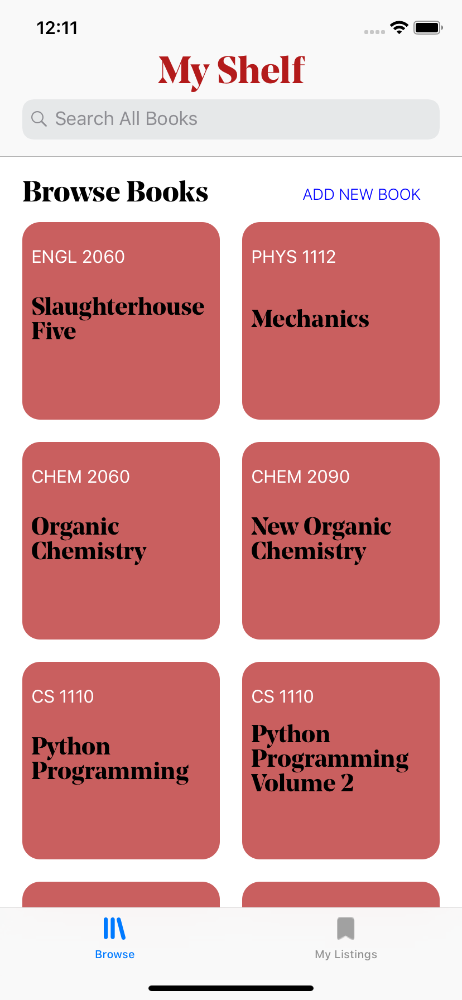
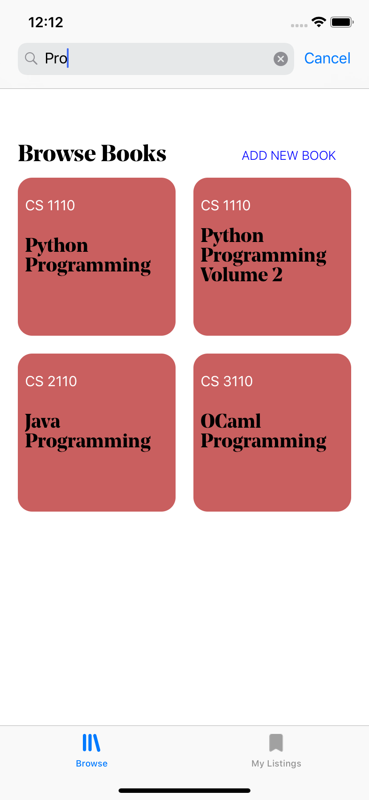
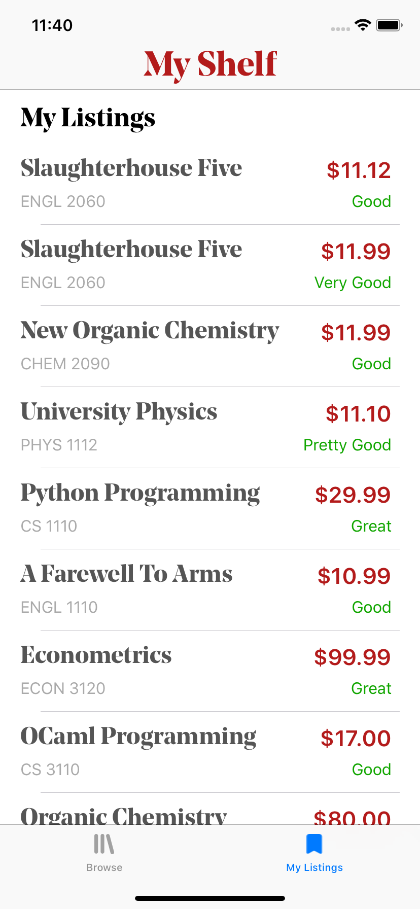
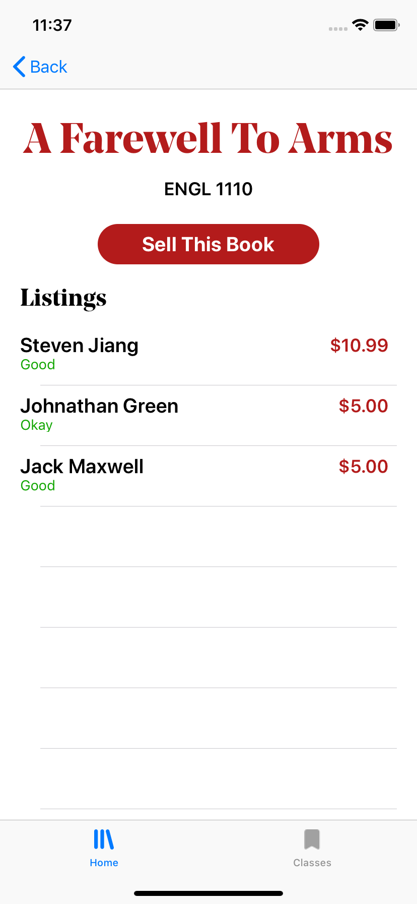
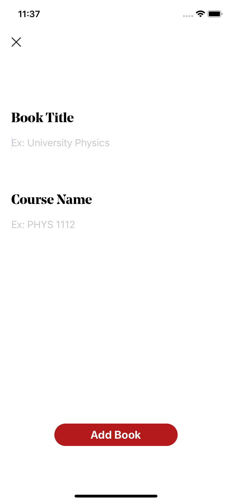
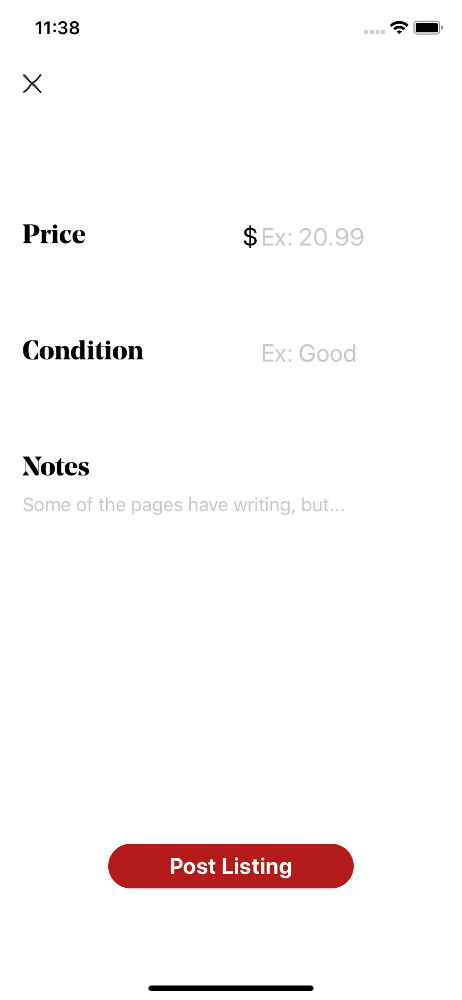

# MyShelf
Hack challenge project

**App Name**: MyShelf

**Tagline**: Platform for a community of Cornell students to buy and sell their used textbooks and course materials in an efficient manner through price comparisons. 

**Description and Features**: 
MyShelf allows sellers to post new books for sale and add listings to existings books in the database. Sellers are able to view all 
their listings and associated important information. The app gives buyers the ability to compare prices, conditions, and sellers of 
books or items. Buyers can search for specific books using a search bar. The app is meant to be organized in a manner that is relatively 
easy for users to find what they are looking for.

**Screenshots from MyShelf**:

**Backend Repository**:
https://github.com/tectonic8/MyShelf-API

**How MyShelf addresses the Hack Challenge requirements**:
MyShelf contains multiple UITableViews, a UICollectionView, a UITabBarController, a UINavigationController, and a SearchController. We
also used NSLayoutConstraint to layout the UI objects. We integrated the app with GoogleSignIn as well as an external API that our 
backend team wrote. We make requests to the backend using AlamoFire. Our backend API is deployed on Google Cloud and uses the methods we learned in the backend course throughout
the year.

**Comments**:
The app is a little finicky with non-Cornell emails. I was mostly testing with two accounts because I don't have access to that many
emails, so the users end may be a little buggy. I also didn't get to spend as much time as I had wanted on this project due to projects
in other classes and appointments. As a result, the asynchronous functions run a little delayed and off-beat.
